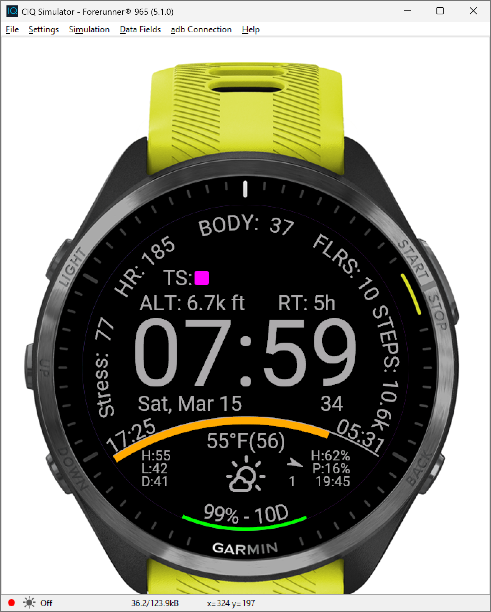
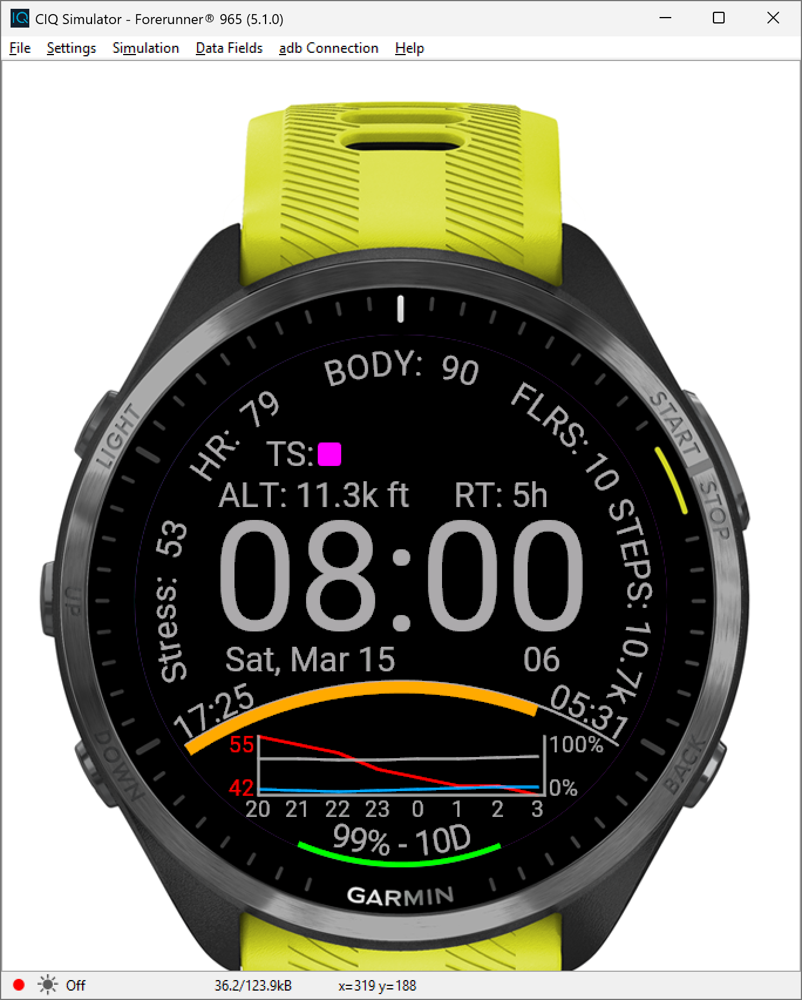
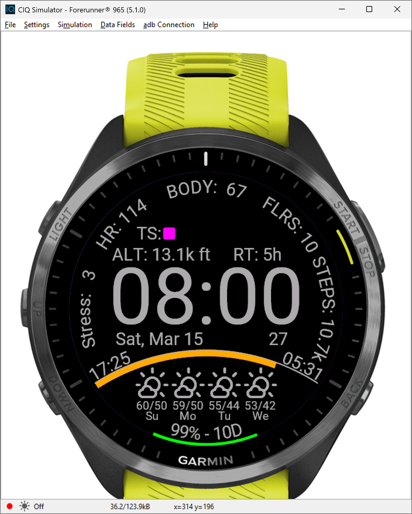

# sun-dial

Watch face that uses complications and onPress method for each. 

Still needs a lot of optimization, and some things don't work well with orange/red shift. 

User settings for units 24 hour etc are not currently used.

Also need to normalize the hardcoded spacing/positions/font sizes to scale with screen resolution. 

Has 3 weather views that you can scroll through by holding the hours/minutes.

